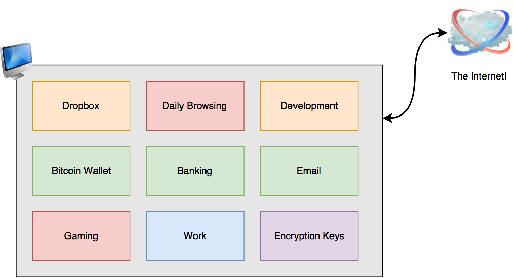
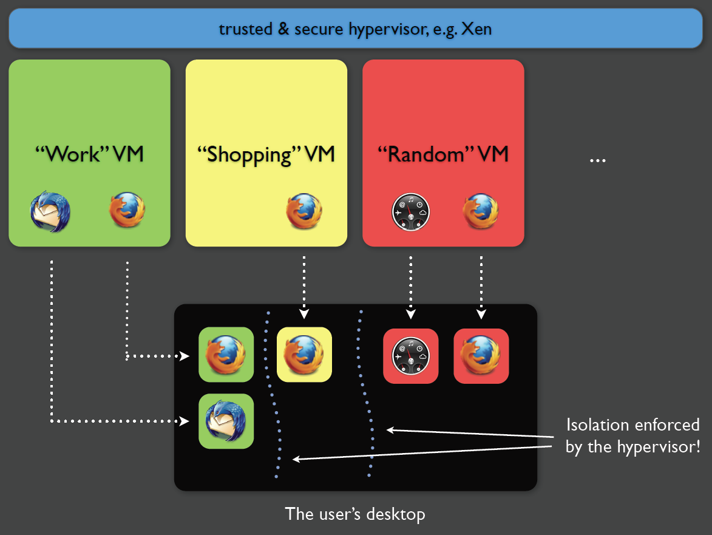
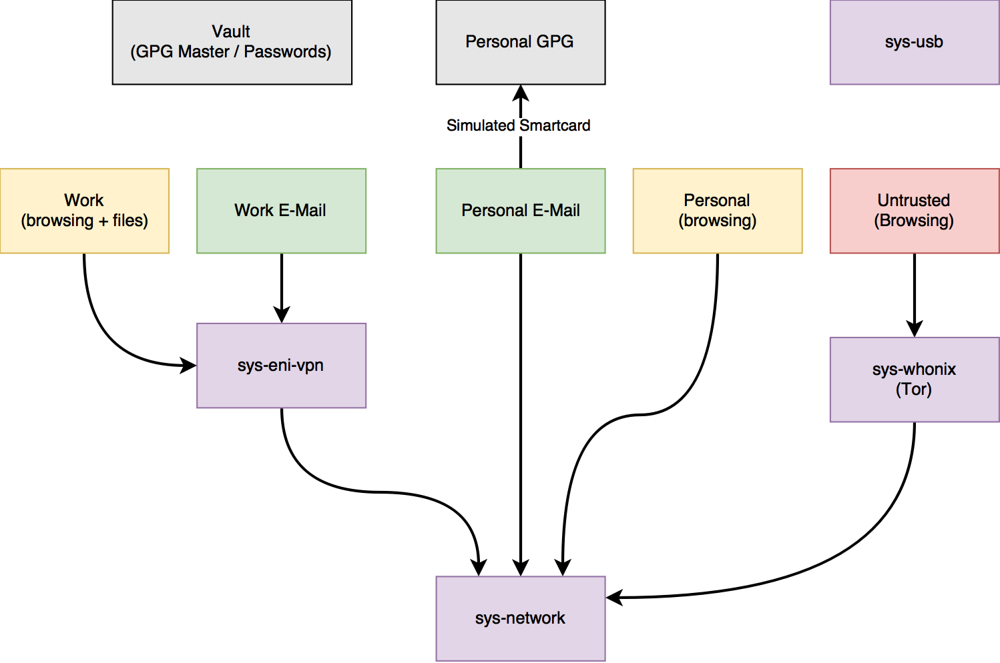
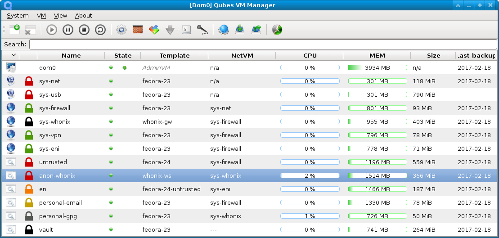
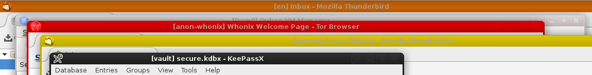
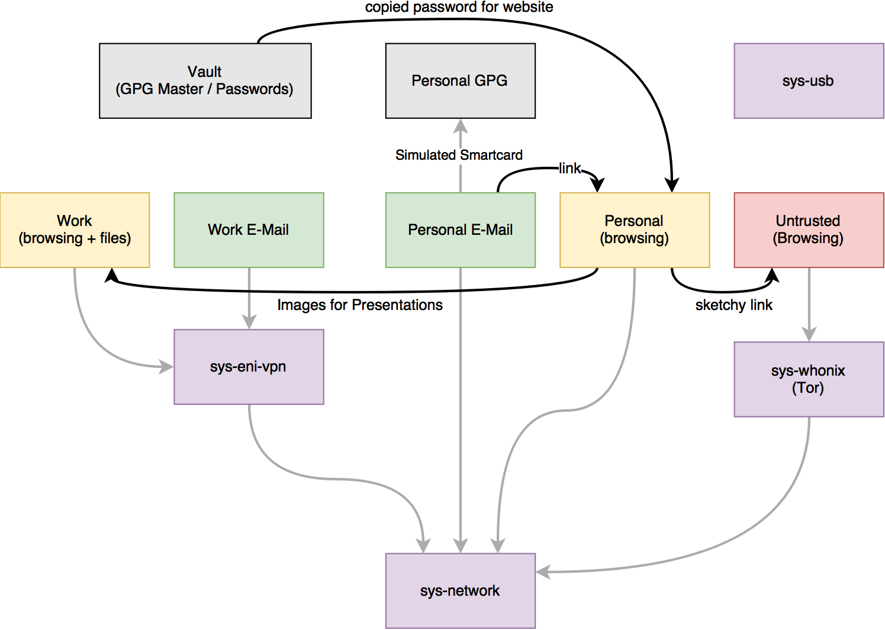
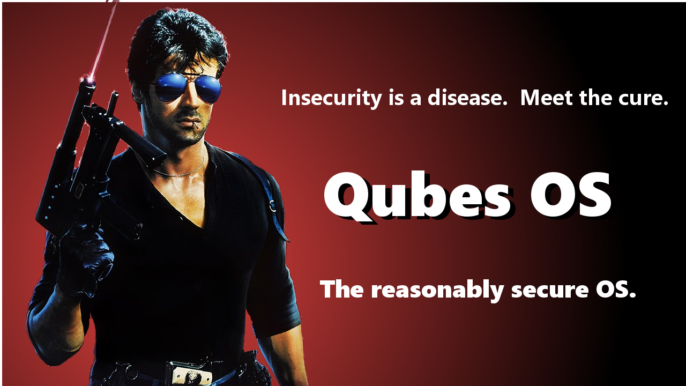
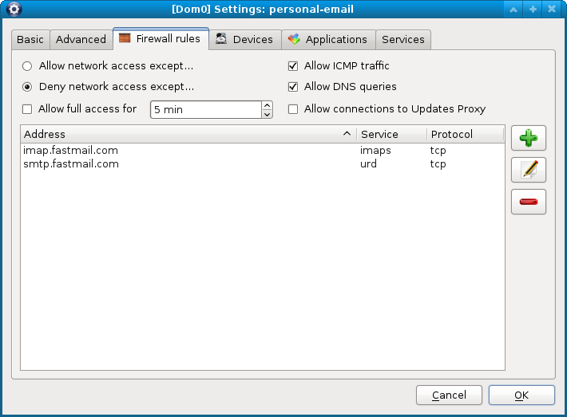
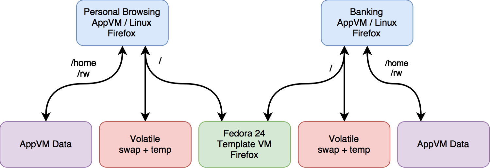
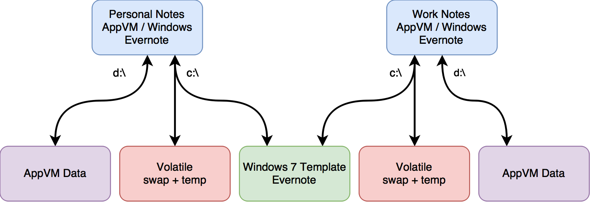

<!-- $theme: gaia -->
<!-- *template: gaia -->
<!-- $size: 16:9 -->
<!-- page_number: true -->
<!-- footer: Qubes OS // 2017-03-02 -->

<style>
</style>

# Qubes OS
#### A ==reasonably== secure operating system


---

<!-- *template: invert -->

> Qubes OS is a security-focused desktop operating system that aims to provide ==security through isolation==.

---

# Life ==before== Qubes OS



<!--
This is dangerous because there is no separation between concerns
a malicious app has access to the Internet and most/all of your user
data

cryptomalware
bogus browser plugins

I love trying new software and tools.
-->

---

#### Qubes allows ==separating concerns== into VMs

* Limit harm from rogue processes
	* Limit what data they have access to
	* Strict control over network access
	* Strict control on sharing of data between VMs
	* Identify which domain a process belongs to
* More practical than physical isolation
* Security++ and Privacy++

---

# Life ==with== Qubes OS



---



---

# Security Features

* Xen hypervisor on the bare metal 
* Single User
* Full drive encryption required
* Tamper resistance - TPMs & Anti-Evil-Maid
* Separate concerns by isolating them in VMs
* Management domain (==dom0==) handles VM management & window decorations.
* Risky hardware interactions banished to dedicated VMs

<!--
Why this is better than 
-->

---

<!-- *template: invert -->

## You can't use "beef stew" as a password
## &nbsp;

---

<!-- *template: invert -->

## You can't use "beef stew" as a password
## ==It's not stroganoff==


---

# VM Types

Concerns (or domains) are separated into VMs.

* **AppVMs** run applications and own data
* **TemplateVMs** base image for AppVMs (owns apps)
* **SysVMs** provide services to AppVMs
    * **NetVMs / ProxyVMs** provide network access to AppVMs (or other NetVMs)
    * **USB VM** special VM to handle USB devices
* **DisposableVMs** temporary VMs for unsafe ops

---

# Management Tool



---

# Window Decorations

* Windows from all AppVMs on a common desktop.

*How do you know which VM a window comes from?*

* dom0 owns the window manager
* each VM assigned a color (<font color="red">red</font>, <font color="green">green</font>,  <font color="black">black</font>, ...)
* every window is tagged with VM name and color
* no full-screen applications!

---

<!-- *template: invert -->
# Moving Data between AppVMs


---



---

# The clipboard

**Obviously the clipboard can leak information!** so...

1. Each AppVM has its own private clipboard. 
2. **Manually** move data between local clipboard and system clipboard.

<hr>

* `<ctrl>` + `<alt>` + `c`
 copies local clipboard to system clipboard
* `<ctrl>` + `<alt>` + `v` 
copies system clipboard to local clipboard

---


# Copying files between Qubes

* An AppVM can request a file be transferred to another VM
	* Graphical or CLI
	* All files placed in /home/user/QubesIncoming/[source]
	* Always triggers dom0 prompt!

```sh
qvm-copy-to-vm vault file.txt
```

---

<!-- *template: invert -->


---

<!-- *template: invert -->
# Networking


---

# Networking

* Each AppVM can be assigned a ==single NetVM==
	* **sys-net** - unpriv VM with raw network
	* **sys-firewall** - VM with firewall rules
	* **sys-whonix** - proxy all traffic through Tor
	* **custom VPN** - proxy traffic through VPN
* Each AppVM has its own set of ==firewall rules==
* If no net VM is assigned the AppVM has no network access!

---


---

# Networking - Firewall



---


<!-- *template: invert -->
# TemplateVMs


---

# Templates



* Save space by sharing base images (OS and Apps) between AppVMs

---

# Templates with Windows?!



* Is this even allowed by Windows licensing?

---

# Templates and Updates

* Templates usually own the applications and base system
* Updates are run against the template.  Not each AppVM!
* Updates through Tor:
	* Prevent targetted attacks denying updates
	* Prevent leak of meta-data about packages being used
* Updates through special update proxy service
* Templates have no direct network access!
---

<!-- *template: invert -->
# Hardware Access


---

# Hardware can be ==dangerous==

* Autorun?
* Malicious USB firmware with [BadUSB](https://arstechnica.com/security/2014/07/this-thumbdrive-hacks-computers-badusb-exploit-makes-devices-turn-evil/)
* OS reads partition tables automatically
* USB stack parses USB device information on insertion
* DMA devices can swipe in-memory encryption keys (Qubes doesn't help with this)

---

# USB & PCI

* USB controller owned by unprivileged **USB VM** isolating USB stack
* GUI support for:
	* feeding block devices to specific AppVMs
	* microphones and cameras (Skype!)
* Experimental USB passthrough support
<!-- Arduino development -->
<!-- support for keyboard and mouse passthrough automatically -->

* If hardware supports (VT-d) allows PCI device passthrough for other hardware

---

<!-- *template: invert -->

# Demo

---

<!-- *template: gaia -->

# Qubes Sweet Spot - ==The Road Warrior==

* Securely carry different facets of your life on a single machine
* Need to access company resources
* Need to communicate with home (personal email / Skype)
* Open sketchy attachments from email or USB stick
* Install sketchy presentation software (cough.. WebEx... cough)
* Connecting through sketchy wireless hotspots
* Accidentally revealing personal information during demos
* Need to conduct personal business while away (banking, ...)